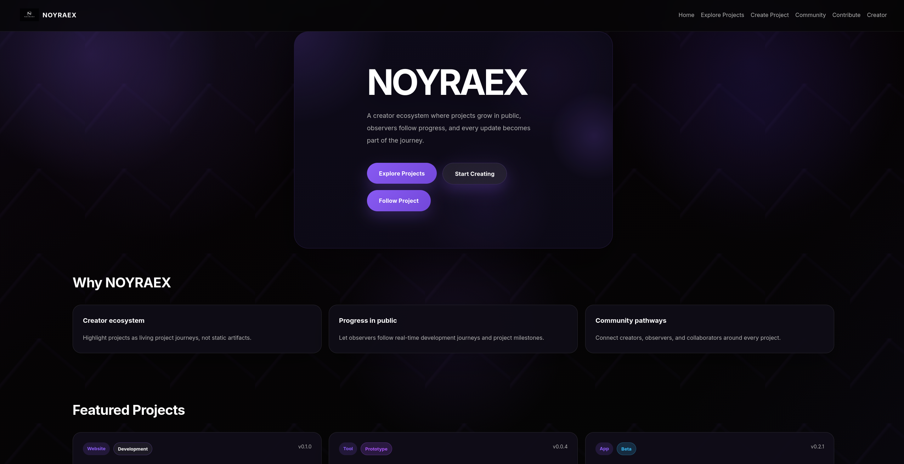

# NOYRAEX

  

**A creator ecosystem where projects become living journeys — not just finished products.**

NOYRAEX is an open-source platform built around the idea that every project has a story.

Instead of showing only the final result, NOYRAEX allows creators to share the entire process: ideas, experiments, development progress, challenges, improvements, and releases.

Creators build.  
People follow.  
Communities contribute.

NOYRAEX turns development into an open journey.

---

## Vision

Most platforms show only the final product.

NOYRAEX focuses on everything that happens before that moment.

We believe the process behind a project is just as valuable as the final result.

Every idea, every improvement, and every challenge can become part of a bigger story.

Our goal is to create an ecosystem where creators can build openly and where communities can participate in the evolution of projects.

---

## What is NOYRAEX?

NOYRAEX is a platform where creators can:

- Create and showcase projects
- Share development progress
- Document project evolution
- Receive feedback from the community
- Build a public creator identity
- Connect with contributors

Projects are not static pages.

They are living journeys.

---

## Current Features

- Creator projects
- Project journey pages
- Project details
- Development timeline
- Creator profiles
- Community section
- Contribution system
- Local project storage
- Responsive interface

---

## Roadmap

NOYRAEX is built step by step.

The project roadmap includes platform development, community features, creator tools, and future ecosystem expansion.

For the full development plan:

[View Roadmap](ROADMAP.md)

---

## Technology

### Current

- HTML5
- CSS3
- JavaScript
- LocalStorage

### Future

- Backend infrastructure
- Database
- Authentication
- Cloud storage

---

## Contributing

NOYRAEX is an open-source project, and everyone is welcome to participate.

You don't need to be only a developer.

We are looking for:

- Developers
- UI/UX designers
- Graphic designers
- Writers
- Translators
- Testers
- Community contributors

You can help by:

- Reporting bugs
- Suggesting ideas
- Improving documentation
- Creating designs
- Writing code
- Testing new features

Every contribution helps build the future of NOYRAEX.

Before starting, check the Issues section or open a discussion about your idea.

---

## Join the Project

Interested in helping build NOYRAEX?

Feel free to explore the repository, share your ideas, create issues, or contribute improvements.

Together we can build a new way to experience projects — from the first idea to the final release.

---

## Philosophy

Projects are journeys.

Creators build.

Observers follow.

Contributors improve.

Together we create an ecosystem.

---

## License

MIT License

---

Made with ❤️ by **Klicxi**
